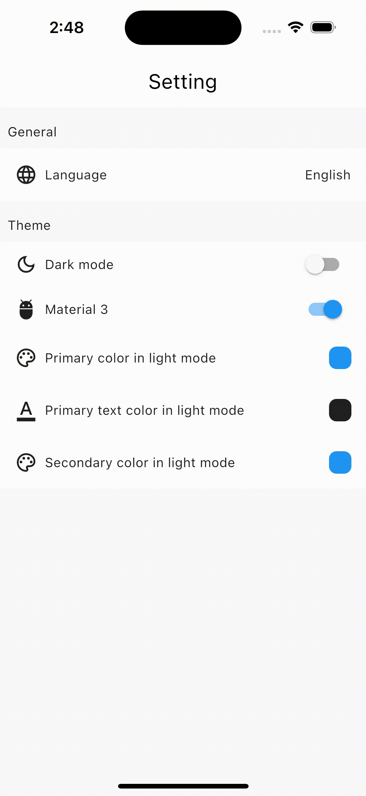
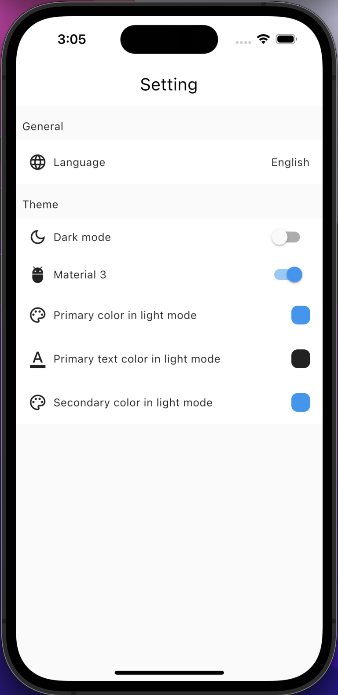
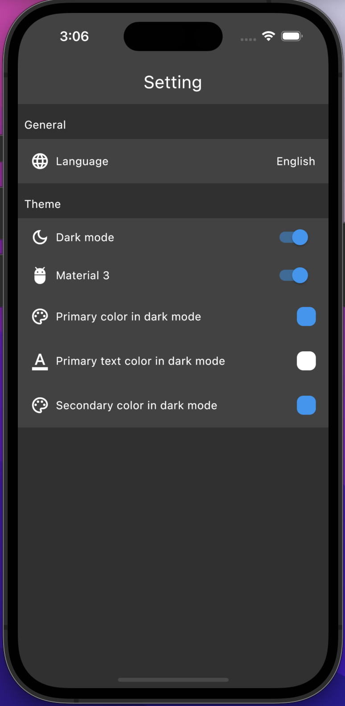
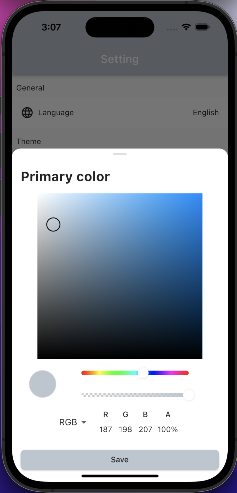

# Boilerplate Code For Flutter Project Using Provider.

A Boilerplate Flutter project base on provider.
Share prefrence, Navigation, theme, setting are implemented.

#### Screenshots

|  Multi Language Support |  Light And Dark Theme Support |
|-----------------------------------------------|-----------------------------------------------|
|  Screenshot Light Theme |  Screenshot Dark Theme |
|-----------------------------------------------|
 Color picker |

